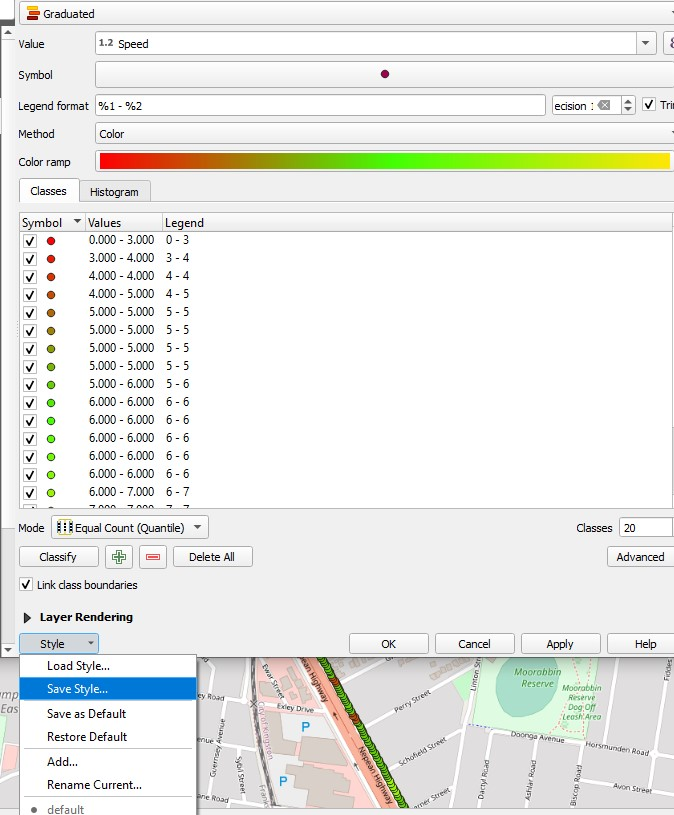

# DFYCyclingShapeFile
The purpose of this repository is to take various files and collate them into a shapefile for easy viewing on the open source software QGIS

To start, make sure to have Python 3 installed https://www.python.org/downloads/.
You will also need to install the open source software QGIS https://qgis.org/en/site/forusers/download.html Only the QGIS Standalone installer version is required, not the network installer.

After downloading and installing pyhton and QGIS you will need to download Garmin's FIT SDK. The WAHOO ELEMNT GPS device used in this study outputs files in a .fit format and this SDK allows for easy and quick conversion to the more useful CSV format. https://developer.garmin.com/fit/download/

# Connecting the Python project to use the QGIS python as the interpretor
It is necessary to use the QGIS Python otherwise the script would not be able to create the necessary shapefiles.

Navigate to settings in your Python IDE, then Project, then Python interpretor. A virtual environment is not required for this. Choose add interpretor next to the drop down and then choose system interpretor. You will then need to know where you installed QGIS to navigate to the necessary file. We are linking **python-qgis.bat** located in **OSGeo4W\bin** as seen below. This file links to the python as well as the necessary libraries. 

# Retrieving data from the WAHOO ELEMNT
To retrieve the files from the GPS plug it in using a USB-C cable and turn the device on otherwise it will stay in charging mode. It will be called "MTP USB DEVIC", access internal storage and then the exports folder and there all of the recorded rides will be present. They are named by the date and time the rides were recorded. Copy and paste all rides to local storage for analysis.

Alternatively the data can also be sent from the mobile phone the device is paired to by navigating to the ELEMNT app. Select the history tab and then choose the ride you wish to export. 

Select the kebab menu then choose **upload workout** 

Then select **Share file to...** 

At this point you have many options to email the file or store it on a variety of different cloud storage options that are installed on the phone. Now you have a .fit file that reads as complete jargon so before anything useful can be done with it it must be converted into a readable csv file using Garmins APK.

# Using the FIT SDK to convert to CSV files
After unpacking the files there is only one file that needs to be used to convert to a .csv format. Navigate to the files you have unpacked and enter the java folder. There you will find many FitToCSV files however the required one is **FitToCSV.bat**. To easily convert a .fit file simply drag and drop a fit file onto the .bat file and a second file will be made in the .csv format. They dont even need to be in the same directory so it is encourage to leave them separated. 

# Finding indexes script

Firstly, ensure the directory is pointing to the correct csv file you are currently analysing.

If any unexpected outputs are happening or errors it could be caused by index changes in the CSV, this is unlikely but in the event of it occurring the Finding_Indexes.py script should be run and the indexes for the metrics being pulled will be output to the console and the changes should be made in the man script. If any additional metrics are desired then they can easily be added by following the same syntax from the script and ensuring the spelling and capitalisation is the same as is in the csv file.

# Main script

As is, the main script outputs a shapefile with the following attributes:

+ Speed (meters/second)
+ Distance (meters)
+ Altitude (meters)
+ Time (Hours/Minutes/Seconds)

All of this information is displayed in the console when the script is run to give real time feedback to determine if everything is behaving as it should so any necessary changes can be made with the index script.

When running this script both the shape file output name and directory should be altered to wherever you want the shape files to be saved and what to call them:

> data_source = driver.CreateDataSource(r"E:\UNI\Research_assistant\Shape files\Ride 3\Ride_3.shp")

The location and name of the csv file should also be changed

> with open(r"E:\UNI\Research_assistant\Github download shape file creator\Oct-31.csv") as csv_file:

If the date is required as well as the time or in separate fields the syntax below can be used to retreive it:

> print(timestamp.strftime('%Y-%m-%d %H:%M:%S'))

# Viewing in QGIS

1. Open a new project.
2. Drag "OpenStreetMap" under XYZ tiles to Layers and you will see a map of the world show up.

3. Navigate to where you saved the shape files in your directory and drag the **xyz.shp** file onto the map. If still zoomed out dots should appear roughly in your position, zoom in to view the route that was taken on the ride.

  

To view all of the relevant information at any given specific point can be found by zooming into a point selecting the **"Identify Features"** tool and clicking on a point. The selected point remains highlighted in red while in Idenitfy Feature mode.

 

Currently this is just giving is information on the users route and nothing else. A lot more can be done with this software to visualise what happened on the ride, such as:

Colour coding the points to represent something. For this example the points will be gradient colour coded based on the speed the user was travelling at.

Right click the shape files layer and click properties and you should be taken to **"Symbology"**. From there click the drop down that currently reads "Single Symbol" and click **"Graduated"**.

Now any value can be chosen, and the size or colour of the points can determine the scale. This instance speed and colour will be used with a colour ramp of Red-Green-Yellow, with red representing stopped and slow, green being average/median speed and yellow being maximum speed. Then choose around 20 classes to have a larger amount of buckets with smaller ranges and click classify.

 

When analysing with graduated method only one value can be categorised. For any additional identifiers another instance of the ride shape file should be dragged in, given there being more than one instance of a layer, they should be grouped together to keep the layers neat and tidy. Naming and renaming these layers and groups is a good idea to keep track of everything going on.

 

For this new layer rules are going to be used to determine the visual identifiers. The same process as before applies, however, **"Rule-Based"** will be chosen instead of graduated. An empty rule will already exist. Double click the empty rule and choose a suitable name. This example will cover visual markers for when the cyclist stops.

Click the equation button, then the **Fields and Values** drop down then the attribute variables can be double clicked to be referenced in the code area on the left.

The marker shape, colour, size, everything about it can be changed to best represent the data.

The new shapes and points will be placed behind the existing speed circles based on the postioning of the layers in the tab. 

When doing rules more than one rule can be applied to a layer so no additional layers will be required to address data for rule-based markers.

# Viewing more than one ride at a time

Dozens of rides can be viewed at the same time to look for route overlaps or to keep everything in one window for ease of use. It's as simple as just dragging and dropping another shape file onto the screen to add another one.

The only problem is all of the rules applied to one layer do not automically apply to new layers input. Fortunately styles can be saved and loaded to eliminate repettious acts for many rides. When the new shape file is added the saved style can be loaded and apllied efficiently. If doing it for speed rules, two distinctly different rides might look like the same one if the start and or end points are the same as seen below.

 

The marker sizing can be changed to see events on a bigger scale and to highlight the more important measurements.

# Saving

Make sure to save the project often as there is no autosaving feature in this software.
